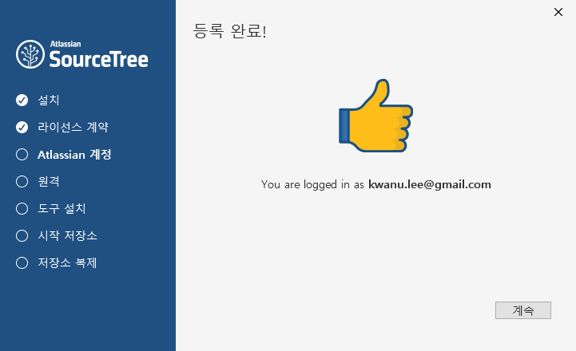

# **git** 클라이언트 설치

##1. git 다운로드 사이트 접속 
	- 명령어 기반 git 클라이언트 다운로드 [https://git-scm.com/downloads](https://git-scm.com/downloads)
	

		
	

	- GUI 기반 git 클라이언트 다운로드 [https://git-scm.com/downloads/guis](https://git-scm.com/downloads/guis)
	

		
	

##2. GUI 기반 git 클라이언트 설치 
### A. **GitHub Desktop**
1. **GitHubDesktop** 선택하여 다운로드

	GUI 기반 git 클라이언트가 초보자에게는 사용하기에 더 적합하므로, GUI 기반 git 클라이언트 중에서 많이 사용되는 GitHubDesktop을 설치를 예시한다. GUI 기반 git 클라이언트 중에서 다른 도구 (예, **SourceTree**)를 설치하여 사용해도 된다. 
		
	

			
	

2. 다운로드한 **GitHubDesktopSetup.exe** 클릭하여 설치 시작 
		
	a. [Skip this step] 클릭
		
	b. [**Name**]과 [**Email**] 란에 사용자 이름과 이메일 주소 입력 후, [**Continue**] 클릭 
		

			
		

	c. [**Finish**] 버튼 클릭하여 설치 완료 
		

					
		
	

### B. **SourceTree**
1. **SourceTree** 선택하여 다운로드
	

			
	

2. 다운로드한 **SourceTreeSetup-2.1.11.0.exe** 클릭하여 설치 시작 
	a. 라이센스 동의
		

				
		

	b. **Atlassian** 계정으로 로그인 

	- 계정이 없으면 [**Sign up**](https://id.atlassian.com/signup?application=mac&tenant=&continue=https%3A%2F%2Fmy.atlassian.com)을 통해 새로운 계정 생성 

		

				
		

	- 기존 계정이 존재하면 계정으로 로그인 
		

				
		

	- 로그인 결과  
		

				
		

	c. **GitHub** 계정과  연결  
		

				
		

	d. **도구 설치** 
		

				
		

