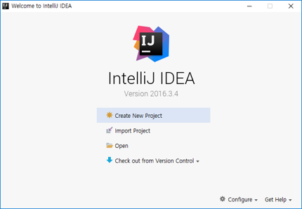
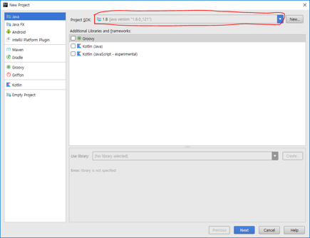
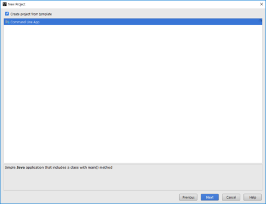
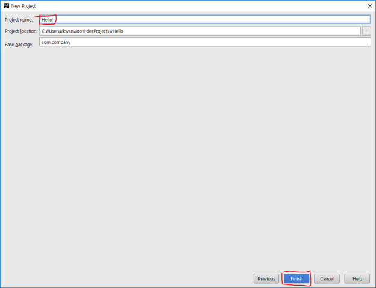
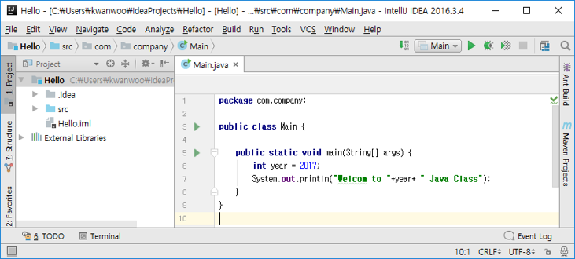
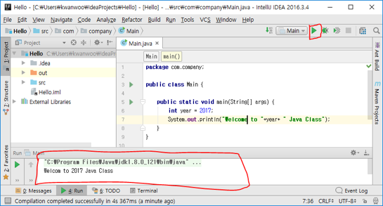

# IntellJ IDEA를 이용한 Java 프로젝트 생성

##1. 프로젝트 생성 
1. Create New Project 메뉴 선택
	
	
	
2. Project SDK의 드롭다운 메뉴에서 설치된 Java SDK를 선택 (Java SDK가 안보이는 경우에는 New 버튼을 누른 후, 설치된 Java SDK 폴더를 선택 후, OK 버튼 클릭)

	
3. “Create project from template” 선택후, Next 버튼 클릭

	
	
4. Project Name 칸에 새로운 프로젝트 이름을 입력 후, Finish 버튼 클릭
	
	

##2. 자바 소스 작성
1. 자바 소스 코드 작성

	
	
	

##3. 컴파일 및 실행

